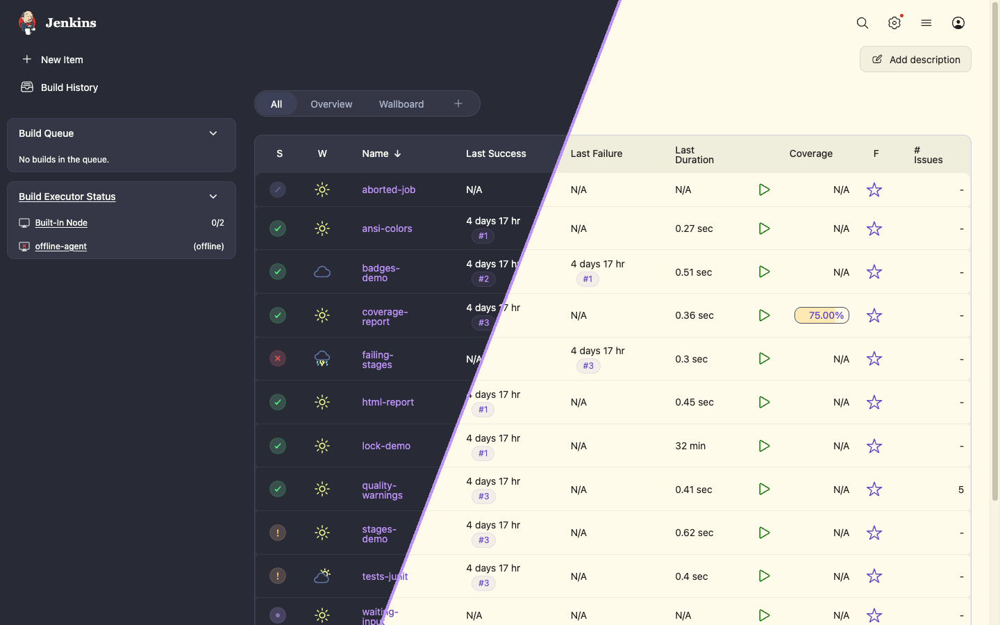
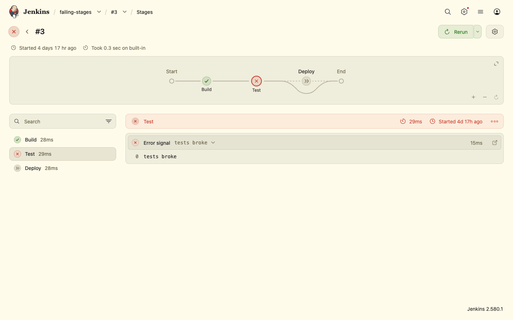
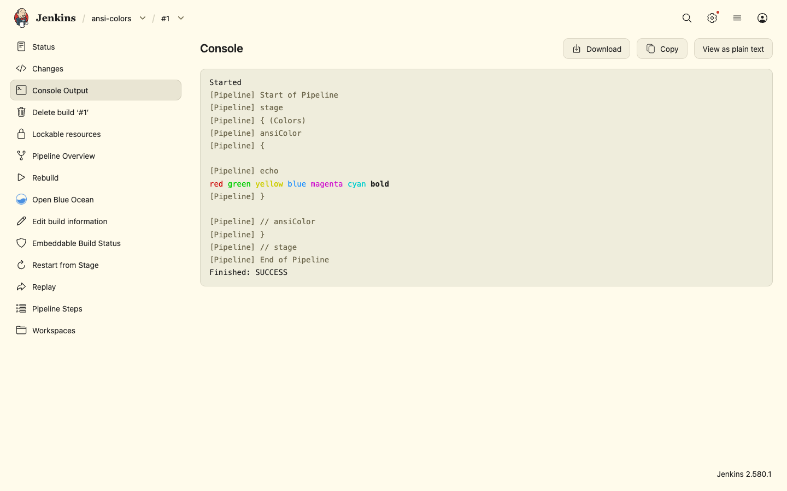
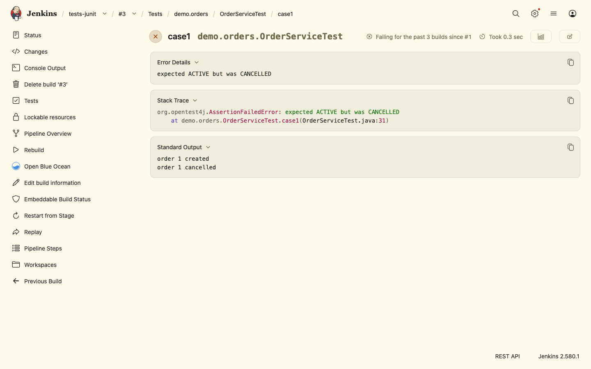
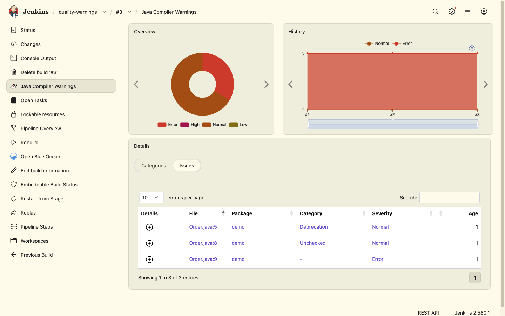
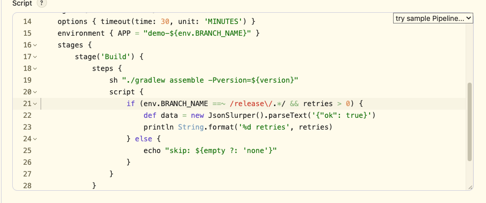
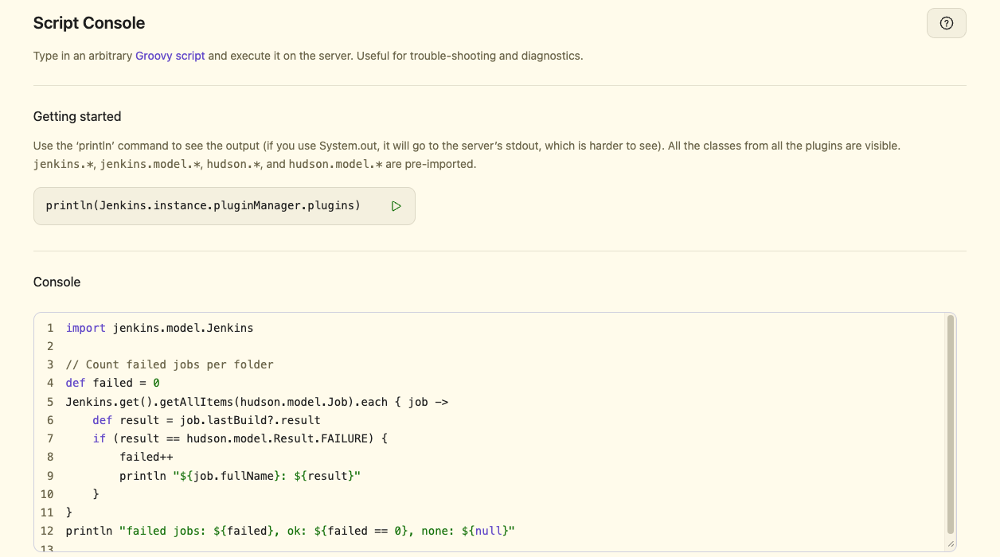
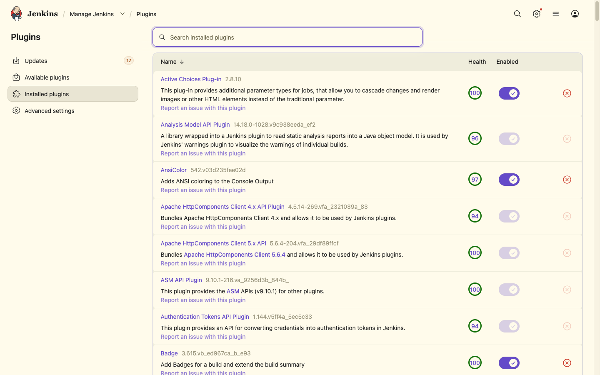
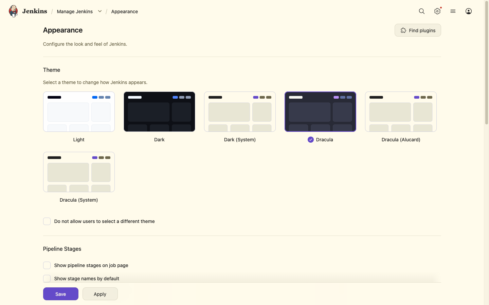

<div align="center">

# 🧛🏻‍♂️ Dracula Theme for Jenkins

Dark and light themes for Jenkins, built on the official [Dracula](https://draculatheme.com) color palette.

[](https://plugins.jenkins.io/dracula-theme/)
[](https://ci.jenkins.io/job/Plugins/job/dracula-theme-plugin/job/main/)
[](https://www.jenkins.io/changelog-stable/)



</div>

## Features

- **Three themes.** **Dracula** is the dark theme. **Dracula (Alucard)** uses Alucard, the official light variant of the palette. **Dracula (System)** follows the dark mode setting of the operating system and switches between the two.
- **The whole Jenkins UI in Dracula colors.** Pages, side panels, cards, tables, forms, buttons, tooltips, dropdowns and dialogs use the colors of the [Dracula spec](https://draculatheme.com/spec).
- **Status colors from the palette.** Successful, failed and unstable builds use the green, red and orange of the palette.
- **Built on Jenkins design tokens.** The themes set only the Jenkins design tokens, so everything that uses them gets the palette with no extra CSS: [Pipeline Graph View](https://plugins.jenkins.io/pipeline-graph-view/), the Pipeline editor, the Script Console, Prism code views such as JUnit stack traces, and more.
- **Bootstrap pages follow the theme.** Bootstrap 5 pages, such as [Warnings Next Generation](https://plugins.jenkins.io/warnings-ng/) and [Coverage](https://plugins.jenkins.io/coverage/), switch to the dark or the light Bootstrap color mode.
- **Native browser controls to match.** Scrollbars, checkboxes and select menus are dark with Dracula and light with Alucard.
- **No stale styles after upgrades.** The stylesheet URL has a content hash, so browsers load the new CSS after a plugin update.

## Screenshots

### Dracula

<table>
  <tr>
    <td width="50%"><p align="center"><b>Pipeline Graph View</b></p></td>
    <td width="50%"><p align="center"><b>Console output</b></p></td>
  </tr>
  <tr>
    <td><p align="center"><b>JUnit test result</b></p></td>
    <td><p align="center"><b>Warnings Next Generation</b></p></td>
  </tr>
  <tr>
    <td><p align="center"><b>Pipeline editor</b></p></td>
    <td><p align="center"><b>Script Console</b></p></td>
  </tr>
  <tr>
    <td><p align="center"><b>Plugin Manager</b></p></td>
    <td><p align="center"><b>Appearance settings</b></p></td>
  </tr>
</table>

### Dracula (Alucard)

<table>
  <tr>
    <td width="50%"><p align="center"><b>Pipeline Graph View</b></p></td>
    <td width="50%"><p align="center"><b>Console output</b></p></td>
  </tr>
  <tr>
    <td><p align="center"><b>JUnit test result</b></p></td>
    <td><p align="center"><b>Warnings Next Generation</b></p></td>
  </tr>
  <tr>
    <td><p align="center"><b>Pipeline editor</b></p></td>
    <td><p align="center"><b>Script Console</b></p></td>
  </tr>
  <tr>
    <td><p align="center"><b>Plugin Manager</b></p></td>
    <td><p align="center"><b>Appearance settings</b></p></td>
  </tr>
</table>

## Installation

The plugin needs Jenkins 2.541.3 or newer. The [Theme Manager](https://plugins.jenkins.io/theme-manager/) plugin is installed with it as a dependency.
The themes were checked page by page on Jenkins 2.580.1 in Chrome.

**From the Update Center:**

1. Go to **Manage Jenkins » Plugins » Available plugins**.
2. Search for **Dracula Theme**, select it and click **Install**.

**From a `.hpi` file:**

1. Build the plugin (see [Development](#development)), or download a `.hpi` file from a release.
2. Go to **Manage Jenkins » Plugins » Advanced settings**.
3. Under **Deploy Plugin**, choose the `.hpi` file and click **Deploy**.

## Usage

**For the whole instance:** go to **Manage Jenkins » Appearance**, select **Dracula**, **Dracula (Alucard)** or **Dracula (System)** and click **Save**.
To use the theme for every user, also select **Do not allow users to select a different theme**.

**For one user:** open your user menu, go to **Appearance** and select one of the Dracula themes.

### Configuration as Code

With the [Configuration as Code](https://plugins.jenkins.io/configuration-as-code/) plugin:

```yaml
appearance:
  themeManager:
    disableUserThemes: true
    theme: "dracula"
```

Use `"draculaAlucard"` for Dracula (Alucard) and `"draculaSystem"` for Dracula (System).

## Palette

The themes set these Jenkins design tokens to the colors of the [Dracula spec](https://draculatheme.com/spec):

| Color                | Dracula                                                                          | Alucard                                                                          | Jenkins tokens                                  |
| -------------------- | -------------------------------------------------------------------------------- | -------------------------------------------------------------------------------- | ----------------------------------------------- |
| Background           |  `#282a36`  |  `#fffbeb`  | `--background`                                  |
| Cards and tables     |  `#353747`  |  `#efeddc`  | `--card-background`, `--table-background`, `--light-grey`, `--very-light-grey` |
| Floating surfaces    |  `#343746`  |  `#efeddc`  | `--overlay-surface-background`                  |
| Inputs               |  `#21222c`  |  `#fffbeb`  | `--input-color`                                 |
| Selection            |  `#44475a`  |  `#cfcfde`  | `--selection-color`, border tokens, `--medium-grey` |
| Foreground           |  `#f8f8f2`  |  `#1f1f1f`  | `--text-color`                                  |
| Comment              |  `#6272a4`  |  `#6c664b`  | `--text-color-secondary`, `--indigo`            |
| Cyan                 |  `#8be9fd`  |  `#036a96`  | `--cyan`, `--teal`                              |
| Green                |  `#50fa7b`  |  `#14710a`  | `--green`                                       |
| Orange               |  `#ffb86c`  |  `#a34d14`  | `--orange`, `--brown`                           |
| Pink                 |  `#ff79c6`  |  `#a3144d`  | `--pink`                                        |
| Purple               |  `#bd93f9`  |  `#644ac9`  | `--accent-color`, `--blue`, `--purple`          |
| Red                  |  `#ff5555`  |  `#cb3a2a`  | `--red`                                         |
| Yellow               |  `#f1fa8c`  |  `#846e15`  | `--yellow`                                      |

## Development

You need JDK 17 or 21 and Maven 3.9 or newer.

```bash
# Start Jenkins with the plugin at http://localhost:8080/jenkins/
mvn hpi:run

# Run the tests and build target/dracula-theme.hpi
mvn verify
```

All styles are in [`src/main/webapp/dracula.css`](src/main/webapp/dracula.css).
Each theme is scoped to its own key, `[data-theme=dracula]`, `[data-theme=dracula-alucard]` or `[data-theme=dracula-system]`, so the stylesheet has no effect when a user selects a different theme.

## Contributing

Bug reports and pull requests are welcome. If a Jenkins page looks wrong with the theme, open an issue with a screenshot and the Jenkins version.
The themes set only the Jenkins design tokens. If a plugin page does not follow the theme, the plugin most likely uses its own colors, so please report it to that plugin.
See the [Jenkins contribution guidelines](https://github.com/jenkinsci/.github/blob/master/CONTRIBUTING.md) for general rules.

## License

[MIT](LICENSE)
