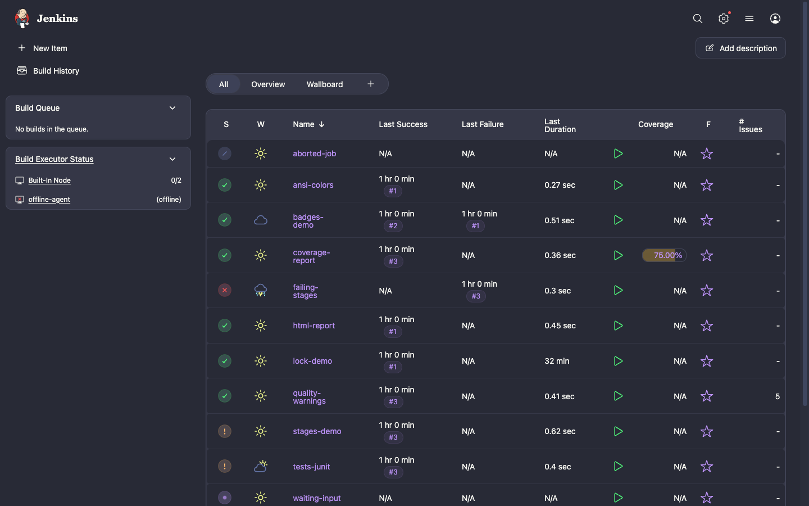
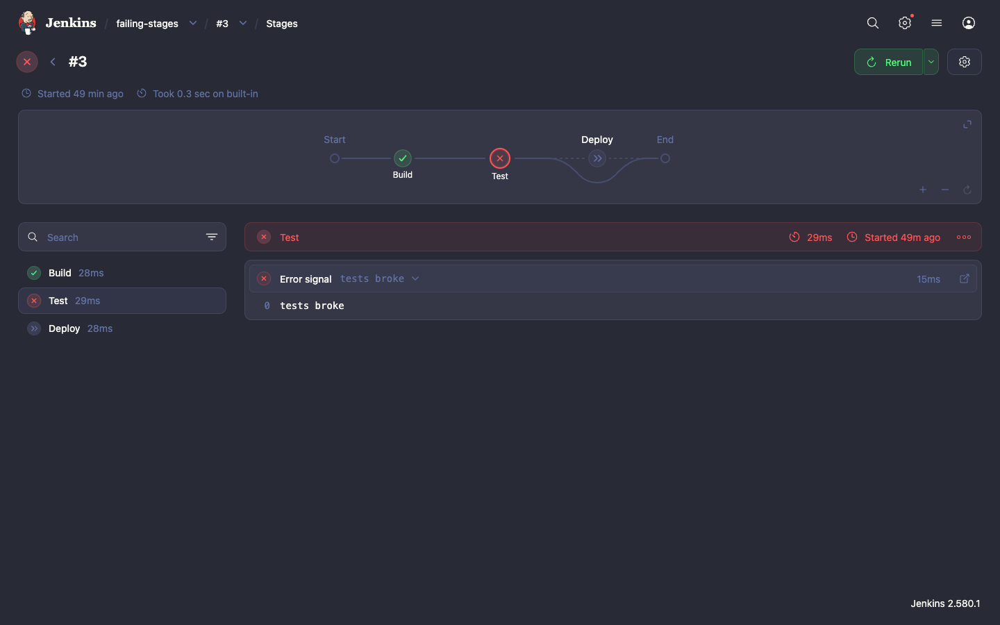
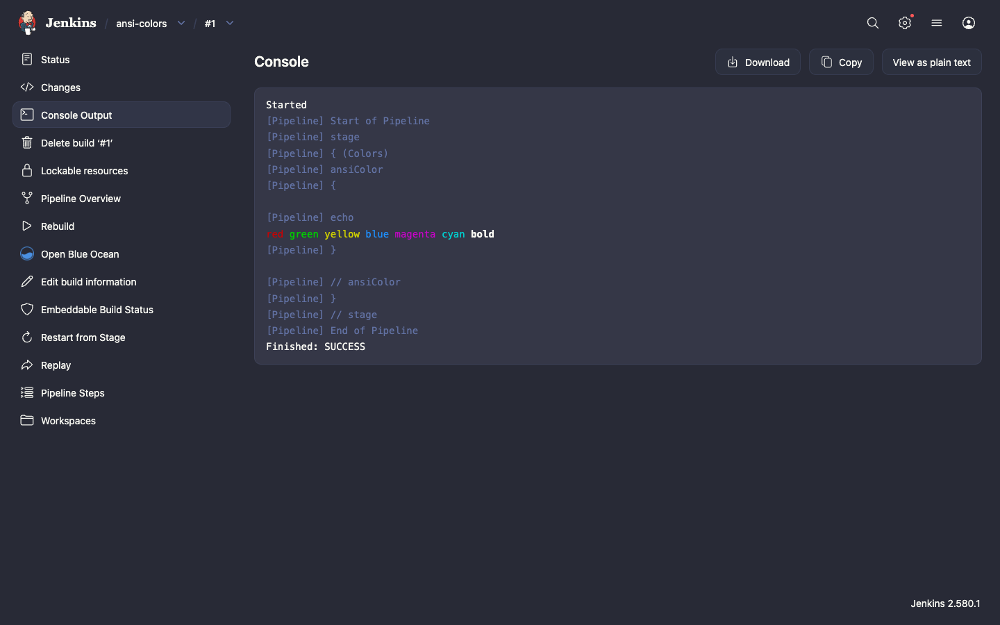
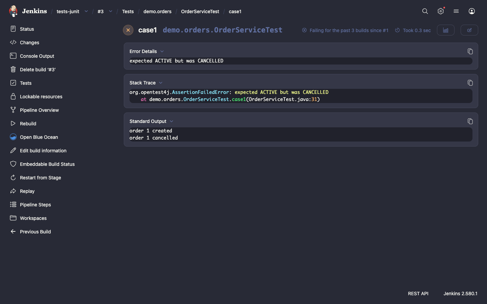
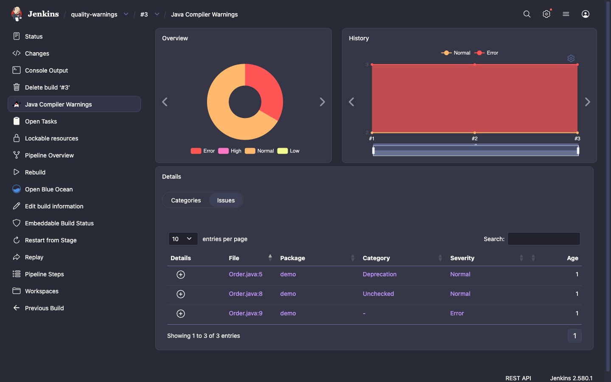
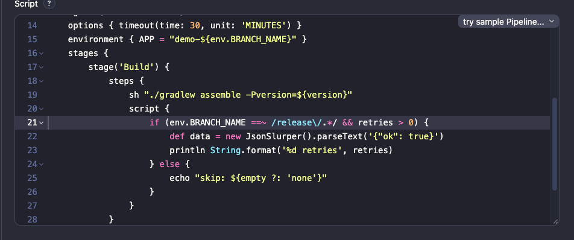
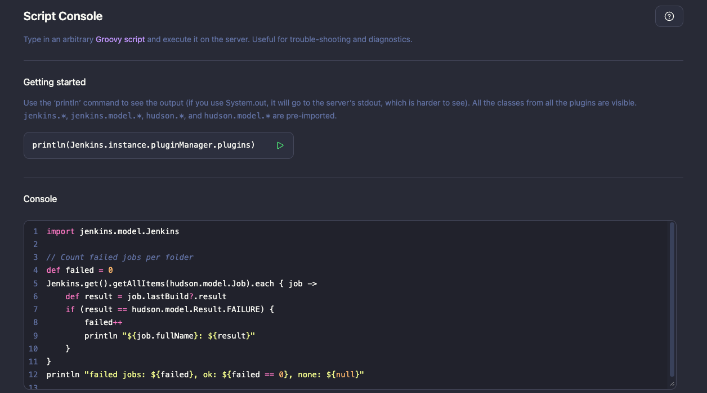
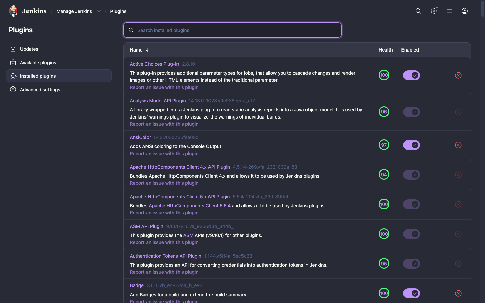
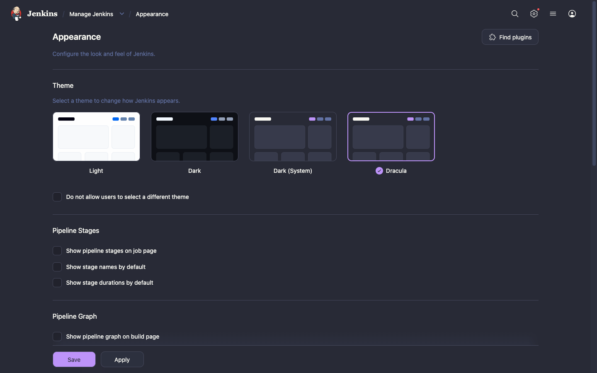

<div align="center">

# 🧛‍♂️ Dracula Theme for Jenkins

A dark theme for Jenkins, built on the official [Dracula](https://draculatheme.com) color palette.

[](LICENSE)
[](https://www.jenkins.io/changelog-stable/)
[](https://plugins.jenkins.io/theme-manager/)
[](https://github.com/jenkinsci/dracula-theme-plugin/actions/workflows/jenkins-security-scan.yml)
[](https://draculatheme.com/spec)



</div>

## Features

- **The whole Jenkins UI in Dracula colors.** Pages, side panels, cards, tables, forms, buttons, tooltips, dropdowns and dialogs use the [Dracula Classic spec](https://draculatheme.com/spec).
- **Status colors from the palette.** Successful, failed and unstable builds use Dracula green, red and orange.
- **Built on Jenkins design tokens.** The theme sets only the Jenkins design tokens, so everything that uses them gets the palette with no extra CSS: [Pipeline Graph View](https://plugins.jenkins.io/pipeline-graph-view/), the Pipeline editor, the Script Console, Prism code views such as JUnit stack traces, and more.
- **Dark Bootstrap pages.** Bootstrap 5 pages, such as [Warnings Next Generation](https://plugins.jenkins.io/warnings-ng/) and [Coverage](https://plugins.jenkins.io/coverage/), switch to the dark Bootstrap color mode.
- **Native browser controls in dark mode.** Scrollbars, checkboxes and select menus are dark too.
- **No stale styles after upgrades.** The stylesheet URL has a content hash, so browsers load the new CSS after a plugin update.

## Screenshots

<table>
  <tr>
    <td width="50%"><p align="center"><b>Pipeline Graph View</b></p></td>
    <td width="50%"><p align="center"><b>Console output</b></p></td>
  </tr>
  <tr>
    <td><p align="center"><b>JUnit test result</b></p></td>
    <td><p align="center"><b>Warnings Next Generation</b></p></td>
  </tr>
  <tr>
    <td><p align="center"><b>Pipeline editor</b></p></td>
    <td><p align="center"><b>Script Console</b></p></td>
  </tr>
  <tr>
    <td><p align="center"><b>Plugin Manager</b></p></td>
    <td><p align="center"><b>Appearance settings</b></p></td>
  </tr>
</table>

## Installation

The plugin needs Jenkins 2.541.3 or newer. The [Theme Manager](https://plugins.jenkins.io/theme-manager/) plugin is installed with it as a dependency.
The theme was checked page by page on Jenkins 2.580.1 in Chrome.

**From the Update Center** (after the plugin is published):

1. Go to **Manage Jenkins » Plugins » Available plugins**.
2. Search for **Dracula Theme**, select it and click **Install**.

**From a `.hpi` file:**

1. Build the plugin (see [Development](#development)), or download a `.hpi` file from a release.
2. Go to **Manage Jenkins » Plugins » Advanced settings**.
3. Under **Deploy Plugin**, choose the `.hpi` file and click **Deploy**.

## Usage

**For the whole instance:** go to **Manage Jenkins » Appearance**, select **Dracula** and click **Save**.
To use Dracula for every user, also select **Do not allow users to select a different theme**.

**For one user:** open your user menu, go to **Appearance** and select **Dracula**.

### Configuration as Code

With the [Configuration as Code](https://plugins.jenkins.io/configuration-as-code/) plugin:

```yaml
appearance:
  themeManager:
    disableUserThemes: true
    theme: "dracula"
```

## Palette

The theme sets these Jenkins design tokens to the Dracula colors:

| Color        | Hex       | Swatch                                                                         | Jenkins tokens                            |
| ------------ | --------- | ------------------------------------------------------------------------------ | ----------------------------------------- |
| Background   | `#282a36` |           | `--background`                            |
| Selection    | `#44475a` |           | `--selection-color`, border tokens        |
| Foreground   | `#f8f8f2` |           | `--text-color`                            |
| Comment      | `#6272a4` |           | `--text-color-secondary`, `--indigo`      |
| Cyan         | `#8be9fd` |           | `--cyan`, `--teal`                        |
| Green        | `#50fa7b` |           | `--green`                                 |
| Orange       | `#ffb86c` |           | `--orange`, `--brown`                     |
| Pink         | `#ff79c6` |           | `--pink`                                  |
| Purple       | `#bd93f9` |           | `--accent-color`, `--blue`, `--purple`    |
| Red          | `#ff5555` |           | `--red`                                   |
| Yellow       | `#f1fa8c` |           | `--yellow`                                |

## Development

You need JDK 17 or 21 and Maven 3.9 or newer.

```bash
# Start Jenkins with the plugin at http://localhost:8080/jenkins/
mvn hpi:run

# Run the tests and build target/dracula-theme.hpi
mvn verify
```

All styles are in [`src/main/webapp/dracula.css`](src/main/webapp/dracula.css).
The theme is scoped to `[data-theme=dracula]`, so it has no effect when a user selects a different theme.

## Contributing

Bug reports and pull requests are welcome. If a Jenkins page looks wrong with the theme, open an issue with a screenshot and the Jenkins version.
The theme sets only the Jenkins design tokens. If a plugin page does not follow the theme, the plugin most likely uses its own colors, so please report it to that plugin.
See the [Jenkins contribution guidelines](https://github.com/jenkinsci/.github/blob/master/CONTRIBUTING.md) for general rules.

## License

[MIT](LICENSE)
