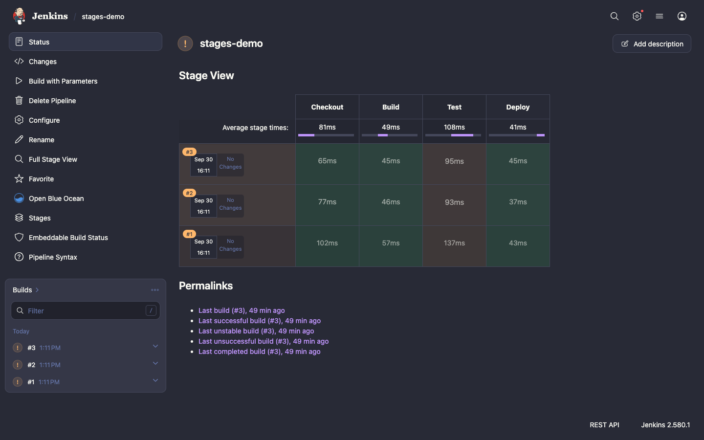

<div align="center">

# 🦇 Dracula Theme for Jenkins

A dark theme for Jenkins, built on the official [Dracula](https://draculatheme.com) color palette.

[](LICENSE)
[](https://www.jenkins.io/changelog-stable/)
[](https://plugins.jenkins.io/theme-manager/)


</div>

## Features

- **The whole Jenkins UI in Dracula colors.** Pages, side panels, cards, tables, forms, buttons, tooltips, dropdowns and dialogs use the [Dracula Classic spec](https://draculatheme.com/spec).
- **Status colors from the palette.** Successful, failed and unstable builds use Dracula green, red and orange. Status icons, Stage View cells and progress bars use the same colors.
- **Console output in terminal colors.** ANSI colors from the [AnsiColor](https://plugins.jenkins.io/ansicolor/) plugin use the Dracula terminal palette, bright colors included.
- **Code editors with Dracula syntax colors:**
  - the ACE Pipeline editor (job configuration, Replay) and its autocomplete popup
  - CodeMirror in the Script Console and other Groovy fields
  - Prism code views in JUnit test results, Coverage and Warnings NG source views
- **Popular plugins that ship their own light styles**, restyled:
  - [Pipeline: Stage View](https://plugins.jenkins.io/pipeline-stage-view/)
  - [Warnings Next Generation](https://plugins.jenkins.io/warnings-ng/), [Coverage](https://plugins.jenkins.io/coverage/) and other Bootstrap 5 and DataTables pages
  - [Allure](https://plugins.jenkins.io/allure-jenkins-plugin/) warnings
- **Plugins that use Jenkins design tokens**, such as [Pipeline Graph View](https://plugins.jenkins.io/pipeline-graph-view/), get the palette with no extra CSS.
- **Native browser controls in dark mode.** Scrollbars, checkboxes and select menus are dark too.
- **No stale styles after upgrades.** The stylesheet URL has a content hash, so browsers load the new CSS after a plugin update.

## Screenshots

<table>
  <tr>
    <td width="50%"><p align="center"><b>Pipeline Stage View</b></p></td>
    <td width="50%"><p align="center"><b>Pipeline Graph View</b></p></td>
  </tr>
  <tr>
    <td><p align="center"><b>Console output with ANSI colors</b></p></td>
    <td><p align="center"><b>JUnit test result</b></p></td>
  </tr>
  <tr>
    <td><p align="center"><b>Pipeline editor (ACE)</b></p></td>
    <td><p align="center"><b>Script Console (CodeMirror)</b></p></td>
  </tr>
  <tr>
    <td><p align="center"><b>Warnings Next Generation</b></p></td>
    <td><p align="center"><b>Appearance settings</b></p></td>
  </tr>
</table>

## Installation

The plugin needs Jenkins 2.528.3 or newer. The [Theme Manager](https://plugins.jenkins.io/theme-manager/) plugin is installed with it as a dependency.
The theme was checked page by page on Jenkins 2.568.3 and 2.580.1 in Chrome.

**From the Update Center** (after the plugin is published):

1. Go to **Manage Jenkins » Plugins » Available plugins**.
2. Search for **Dracula Theme**, select it and click **Install**.

**From a `.hpi` file:**

1. Build the plugin (see [Development](#development)), or download a `.hpi` file from a release.
2. Go to **Manage Jenkins » Plugins » Advanced settings**.
3. Under **Deploy Plugin**, choose the `.hpi` file and click **Deploy**.

## Usage

**For the whole instance:** go to **Manage Jenkins » Appearance**, select **Dracula** and click **Save**.
To use Dracula for every user, also select **Do not allow users to select a different theme**.

**For one user:** open your user menu, go to **Appearance** and select **Dracula**.

### Configuration as Code

With the [Configuration as Code](https://plugins.jenkins.io/configuration-as-code/) plugin:

```yaml
appearance:
  themeManager:
    disableUserThemes: true
    theme: "dracula"
```

## Known limitations

- **Blue Ocean** is not styled. Theme Manager does not add theme stylesheets to Blue Ocean pages, so this is the same for every Jenkins theme.
- **Charts that the server renders as PNG images** keep their white background. This includes the Build Time Trend and Load Statistics graphs in Jenkins core and the test trend portlet of Dashboard View.
- **HTML Publisher reports** open in the plugin's own report frame, which does not load Jenkins styles.

## Palette

| Color        | Hex       | Swatch                                                                         | Used for                                  |
| ------------ | --------- | ------------------------------------------------------------------------------ | ----------------------------------------- |
| Background   | `#282a36` |           | Page background                           |
| Selection    | `#44475a` |           | Selection, borders                        |
| Foreground   | `#f8f8f2` |           | Text                                      |
| Comment      | `#6272a4` |           | Secondary text, comments in code          |
| Cyan         | `#8be9fd` |           | Information                               |
| Green        | `#50fa7b` |           | Success                                   |
| Orange       | `#ffb86c` |           | Unstable builds, warnings                 |
| Pink         | `#ff79c6` |           | Keywords in code                          |
| Purple       | `#bd93f9` |           | Accent, links, primary buttons            |
| Red          | `#ff5555` |           | Failure, errors                           |
| Yellow       | `#f1fa8c` |           | Strings in code                           |

## Development

You need JDK 17 or 21 and Maven 3.9 or newer.

```bash
# Start Jenkins with the plugin at http://localhost:8080/jenkins/
mvn hpi:run

# Run the tests and build target/dracula-theme.hpi
mvn verify
```

All styles are in [`src/main/webapp/dracula.css`](src/main/webapp/dracula.css).
The theme is scoped to `[data-theme=dracula]`, so it has no effect when a user selects a different theme.

## Contributing

Bug reports and pull requests are welcome. If a page or a plugin looks wrong with the theme, open an issue with a screenshot and the plugin name and version.
See the [Jenkins contribution guidelines](https://github.com/jenkinsci/.github/blob/master/CONTRIBUTING.md) for general rules.

## Credits

- The [Dracula Theme](https://draculatheme.com) and its palette were created by [Zeno Rocha](https://github.com/zenorocha) and the Dracula contributors.
- The plugin structure follows the [Nord](https://github.com/jenkinsci/nord-theme-plugin) and [Catppuccin](https://github.com/jenkinsci/catppuccin-theme-plugin) theme plugins for Jenkins.

## License

[MIT](LICENSE)
